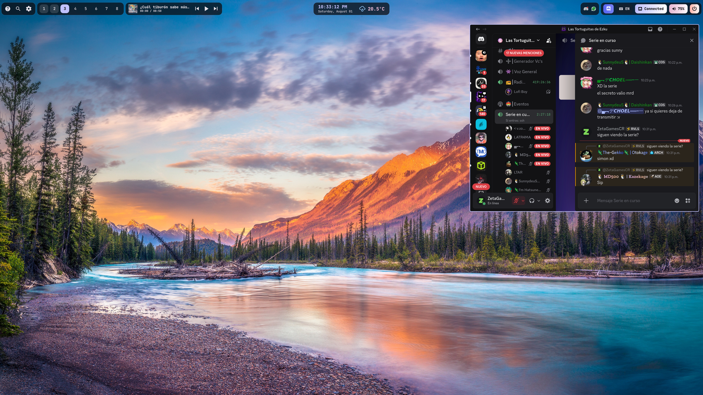

# 🎮 Hyprland Discord Widget

An interactive **Discord** widget designed for **Hyprland** and **Quickshell**. It transforms the official Discord application into a floating pop-up widget that seamlessly appears right below the top bar at the press of a button.



---

## ⚡ Quick Installation (One-Line Command)

Copy and paste this single command into your terminal to automatically install and configure everything:

```bash
curl -fsSL https://raw.githubusercontent.com/Davidzb16/Hyprland-Discord-Widget/main/install.sh | bash
```

---

## 💡 What Does This Widget Do?

- 📍 **Smart Dropdown**: Transforms the official Discord application (or Vesktop / Flatpak) into a pop-up control panel dynamically positioned right below your top bar.
- 🖥️ **Multi-Monitor & DPI Aware**: Automatically detects the currently active monitor and its scale factor (1.0x, 1.5x, 4K, etc.) ensuring the window is 100% visible with zero edge clipping.
- 🎨 **Fluid Shell Animations**: Features a smooth sliding transition (*Slide Top*) when deploying down from the top bar and when sliding back up to close.
- 🔒 **Rigid Position Lock**: Includes a lightweight background daemon managed by `systemd` that prevents accidental mouse dragging or displacement.
- 🔀 **Widget Overlap Prevention**: Automatically closes Discord if another top bar widget (*Volume, Network, Battery, etc.*) is activated to avoid screen overlap.
- 📌 **Tiling Independent**: Completely floating and pinned (`float = on`, `pinned = true`), guaranteeing it will never disrupt or alter the layout of your open tiled applications.

---

## 🛠️ Requirements
- **Hyprland** (v0.50+)
- **Python 3** & `jq`
- **Quickshell** (Optional, for TopBar button integration)
- Installed Discord app (Flatpak or native package)

---

## 🚀 Quick Usage
- **Toggle widget open/close**:
  ```bash
  python3 ~/.config/hypr/scripts/position_discord_widget.py
  ```
- **Quickshell `qs_manager.sh` Integration**:
  ```bash
  ~/.config/hypr/scripts/qs_manager.sh toggle discord
  ```

---

## 📜 License
MIT License. Feel free to modify and elevate your Hyprland Rice! 🎨
